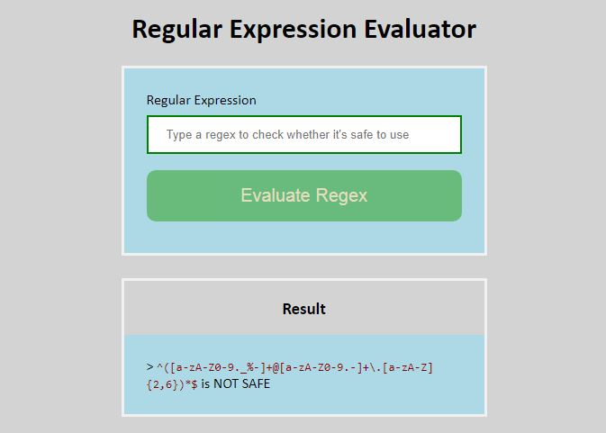

### COMMON ATTACKS ON WEB APPLICATIONS

## Background
### Trey Coding: Defensive Coding in JavaScript

Congrats! You were just hired as a junior web developer at Trey Corp! Trey Corp has been around for several decades. Over the years, developers rarely had the opportunity to maintain their code. That’s where you come in - your first assignment at Trey Corp is to update some of the legacy code.

The code you’ve been tasked to update is a Node.js express server that hosts web pages consisting of various utilities. Senior devs want you to find and fix any vulnerabilities you come across to improve overall security. Good luck!

# Project
This project :
+ uses `eslint` to find javascript errors and eliminate them
+ `Regex Evaluator` from `regex.js` to find unsafe regular expressions and convert them to `/.*/` for later changes to be made.
+ replaces  `eval` with `safeEval` from `safe-eval` in `calculator.js`
+ replaces `exec` with `execFile` from `child_process` in `linux.js`
+ combines userinput `filename` with current working directly using `path.join` and `process.cwd()` to eliminate vulnerability in `main.js`;

